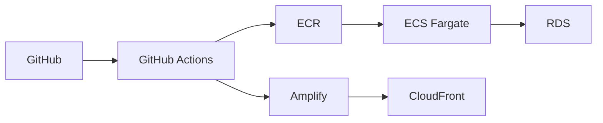
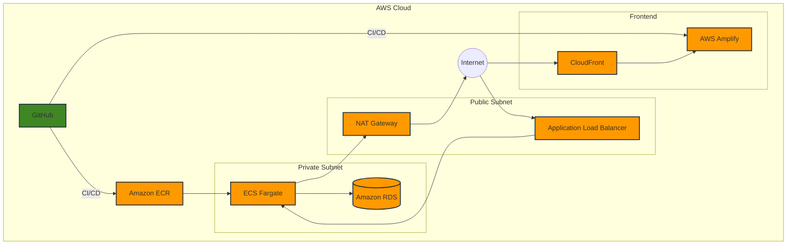

# /workspaceで実行

## コンテナを再ビルドしてバックエンドで 起動
docker-compose -f docker/dev/compose.yml down --rmi all
docker-compose -f docker/dev/compose.yml build --no-cache
docker-compose -f docker/dev/compose.yml up -d

## コンテナの状態を確認
docker-compose -f docker/dev/compose.yml ps

## バックエンドのコンテナを再起動
docker-compose -f docker/dev/compose.yml restart backend

## バックエンドのコンテナを停止
docker-compose -f docker/dev/compose.yml stop backend

## バックエンドのコンテナに入る
docker-compose -f docker/dev/compose.yml exec backend /bin/bash

## フロントエンドのコンテナに入る
docker-compose -f docker/dev/compose.yml exec frontend /bin/bash
npx shadcn-ui@latest init

## データベースのコンテナに入る
docker-compose -f docker/dev/compose.yml exec db /bin/bash

## データベースに入る
docker-compose -f docker/dev/compose.yml exec db psql -U postgres -d postgres

## 一通りのデータベースの操作コマンド
\d # テーブル一覧
\l # データベース一覧
\c app # データベースに接続
\dt # テーブル一覧
\q # データベースから出る

## 一通りのSQL操作コマンド
SELECT * FROM users;
INSERT INTO users (name, email) VALUES ('John Doe', 'john.doe@example.com');
UPDATE users SET email = 'john.doe@example.com' WHERE name = 'John Doe';
DELETE FROM users WHERE name = 'John Doe';

## Dev環境でのマイグレーション
docker-compose -f docker/dev/compose.yml exec backend /bin/bash
poetry run alembic init alembic #マイグレーションファイルを作成
poetry run alembic revision --autogenerate -m "migration name" #マイグレーションファイルを作成
poetry run alembic upgrade head #マイグレーションを適用
poetry run alembic downgrade -1 #前のマイグレーションにダウングレード
poetry run alembic downgrade <revision> #指定したマイグレーション番号にダウングレード
poetry run alembic current #現在のマイグレーション番号
poetry run alembic history #マイグレーションの履歴
poetry run alembic heads #次のマイグレーション番号
poetry run alembic upgrade head --sql > migration.sql

## マイグレーションファイルの整理（本番稼働前はマイグレーションファイルは基本１つでよい）
docker-compose -f docker/dev/compose.yml exec backend /bin/bash
poetry run alembic downgrade -1 または、poetry run alembic downgrade <revision>
もどしたリビジョンまでのマイグレーションファイルを削除
poetry run alembic revision --autogenerate -m "INITIAL"
poetry run alembic upgrade head

## マイグレーションファイルのキャッシュ削除
sudo rm -rf backend/alembic/versions/__pycache__

## FastApi Docs
http://localhost:5000/docs

## Frontend
http://localhost:3000/

## マイグレーションファイルの削除
sudo rm -rf backend/alembic/versions/__pycache__

## 不要なイメージを削除
docker system prune

## 不要なイメージを削除
docker system prune -a

## 不要なイメージを削除
docker system prune -a --volumes

## フロントのUIコンポーネントを追加
npx shadcn-ui@latest add 

### アーキテクチャ

